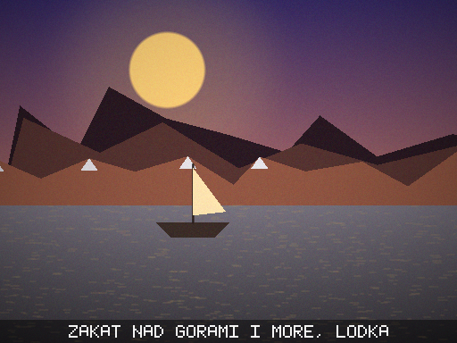
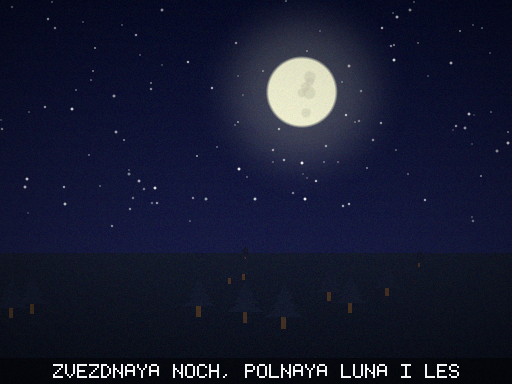
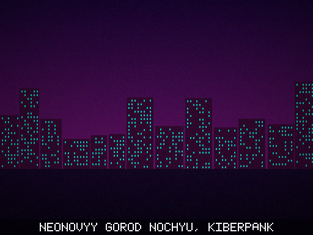
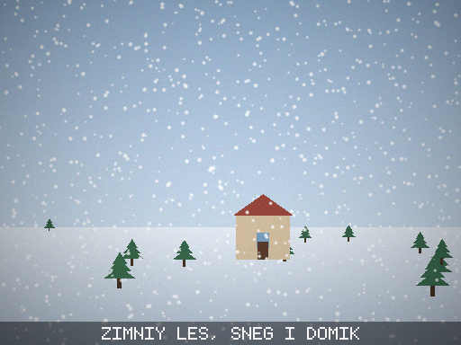
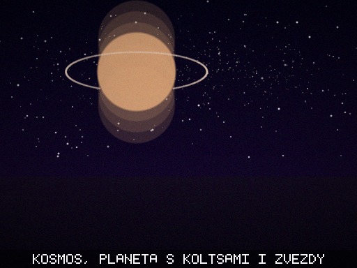
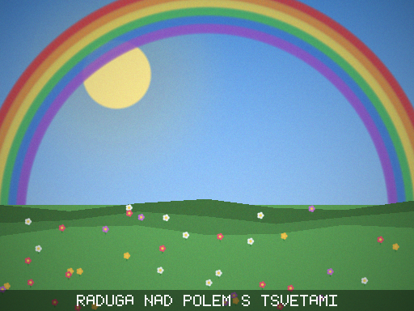

# MyBot 🧠🎨

Маленькая **библиотека ИИ на чистом Python** — без numpy, PyTorch и вообще без
единой сторонней зависимости. Здесь два больших блока, оба написаны с нуля:

1. **Нейросети** — тензоры, автоматическое дифференцирование (autograd), слои,
   оптимизаторы и обучаемые модели (полносвязная сеть и символьная RNN, которая
   генерирует текст и «болтает»).
2. **Генерация картинок из текста** (text-to-image) — свой PNG-кодер, растровый
   движок и «понимание» промпта на русском и английском. Вводишь описание —
   получаешь настоящий PNG. Работает офлайн, без API и ключей.

Проект образовательный: цель — показать, **как именно** всё работает внутри, а
не спрятать за чужой библиотекой.

## 🎨 Картинка из текста

```bash
python -m mybot imagine "закат над горами и море, лодка" -o sunset.png
python -m mybot imagine "звёздная ночь, полная луна и лес" --size 768
python -m mybot web        # веб-приложение: вводишь промпт — видишь картинку
```

Примеры (см. папку [`examples/`](examples/)):

| Промпт | Результат |
|---|---|
| `закат над горами и море, лодка` |  |
| `звёздная ночь, полная луна и лес` |  |
| `неоновый город ночью, киберпанк` |  |
| `зимний лес, снег и домик` |  |
| `космос, планета с кольцами и звёзды` |  |
| `радуга над полем с цветами` |  |

Как из кода:

```python
from mybot import generate_image
scene = generate_image("гроза над городом, молния", "storm.png", width=640, height=480)
print(scene.palette.name, scene.objects)   # storm ['city']
```

Движок понимает **время суток** (день/закат/ночь/рассвет), **атмосферу**
(гроза, космос, неон, зима, осень), **объекты** (солнце, луна, звёзды, горы,
лес, море, озеро, облака, дождь, снег, дом, город, цветы, птицы, лодка, планета,
радуга, туман, дорога, холмы, пустыня) и **стиль** (винтаж, минимализм, яркий,
мечтательный). Слова распознаются в разных падежах (`город`, `городом`,
`городах`) и на двух языках.

Это, конечно, не Midjourney — «настоящую» диффузионную модель нельзя обучить на
чистом Python без GPU и терабайтов данных. Здесь другой честный подход:
**процедурный генератор**, который действительно строит изображение из смысла
текста, а не подбирает пиксели вслепую.

```
mybot/
├── engine/          # ядро
│   ├── tensor.py    # тензор + автоград (forward и backward для ~20 операций)
│   ├── nn.py        # слои: Linear, RNNCell, Sequential, Dropout, активации
│   ├── functional.py# softmax, log_softmax, cross_entropy, mse_loss
│   ├── optim.py     # SGD (с моментумом), Adam
│   └── utils.py     # батчи, метрики, прогресс-бар, сохранение весов, clip_grad
├── models/
│   ├── mlp.py       # многослойный персептрон
│   └── char_rnn.py  # символьная языковая модель (генерация текста)
├── data/
│   ├── text.py      # словарь символов и нарезка текста на обучающие окна
│   └── corpus_ru.txt# встроенный русский диалоговый корпус
├── imaging/         # генерация картинок из текста (text-to-image)
│   ├── png.py       # PNG-кодер на чистом Python (zlib + struct)
│   ├── canvas.py    # растровый холст: фигуры, градиенты, сглаживание
│   ├── font.py      # встроенный растровый шрифт 5x7 для подписей
│   ├── palette.py   # палитры и настроение по словам
│   ├── prompt.py    # разбор промпта в сцену (ru/en, падежи)
│   ├── render.py    # рисование объектов (солнце, горы, город...)
│   └── generator.py # сборка сцены по слоям + стиль + подпись
└── apps/            # готовые демо
    ├── xor.py       # сеть учит XOR
    ├── spiral.py    # классификация двух спиралей + ASCII-карта решений
    ├── textgen.py   # обучение RNN и чат с ней
    ├── imagine.py   # генерация картинки из текста в PNG
    └── web.py       # веб-приложение для генерации картинок
```

## Требования

Только **Python 3.8+**. Больше ничего ставить не нужно.

## Быстрый старт

```bash
# список демо
python -m mybot

# картинка из текста (см. раздел выше)
python -m mybot imagine "закат над горами и море"
python -m mybot web

# 1) сеть учится логике XOR (несколько секунд)
python -m mybot xor

# 2) классификация двух спиралей — в конце печатается карта решений
python -m mybot spiral

# 3) обучить символьную RNN и посмотреть, что она генерирует
python -m mybot textgen --steps 1500

# 4) поболтать с обученной моделью
python -m mybot textgen --load --chat
```

### Пример вывода `spiral`

```
Точность на проверочной части: 98.7%

Карта решений (0 и 1 — точки данных, · и ▒ — ответ сети):

▒▒▒▒▒▒▒▒▒▒▒▒▒▒▒▒▒▒▒······
▒▒▒▒▒▒▒▒▒▒11▒1▒··········
▒▒▒▒▒▒1▒11·0·00··········
▒▒▒▒▒11000▒11111▒·0······
▒▒▒▒▒▒▒111111111·00······
...
```

Одна прямая линия так две спирали не разделит — сеть выучивает изогнутую
границу сама.

## Как это использовать как библиотеку

Знакомый API в духе PyTorch:

```python
from mybot import Tensor, Linear, Adam, F

model = Linear(2, 1)
opt = Adam(model.parameters(), lr=0.1)

x = Tensor([[0.0, 0.0], [1.0, 1.0]])
y = Tensor([[0.0], [1.0]])

for _ in range(200):
    pred = model(x)
    loss = F.mse_loss(pred, y)
    opt.zero_grad()
    loss.backward()      # автоматическое дифференцирование
    opt.step()

print(model(x).tolist())
```

Многослойная сеть для классификации:

```python
from mybot import MLP, Tensor, Adam, F

net = MLP([2, 16, 16, 3], hidden_activation="relu")
logits = net(Tensor([[0.5, -0.2]]))
probs = net.predict_proba(Tensor([[0.5, -0.2]]))  # softmax
```

## Как работает автоград (коротко)

Каждая операция над `Tensor` не только считает результат, но и запоминает,
**как посчитать производную** по своим входам. Вызов `loss.backward()`
обходит граф вычислений в обратном топологическом порядке и накапливает
градиенты в `tensor.grad`. Оптимизатор затем сдвигает веса против градиента.

Правильность градиентов проверяется в тестах **численным дифференцированием**
(центральная разность) — аналитический и численный градиенты должны совпадать.

## Тесты

```bash
python -m unittest discover -s tests -v
```

Покрыто (46 тестов): формы и бродкастинг, матричное умножение, все активации,
softmax и кросс-энтропия, оптимизаторы, обучение MLP на XOR, запоминание строки
RNN, словарь символов, а также PNG-кодер, холст, разбор промпта (падежи, ru/en,
отсутствие ложных срабатываний) и детерминизм рендера.

## Ограничения

Это учебный движок на чистом Python: он **медленный** по сравнению с numpy/
PyTorch и рассчитан на маленькие модели и датасеты. Зато весь код читаемый и
помещается в голове — можно проследить путь числа от входа до градиента.

## Лицензия

MIT.
